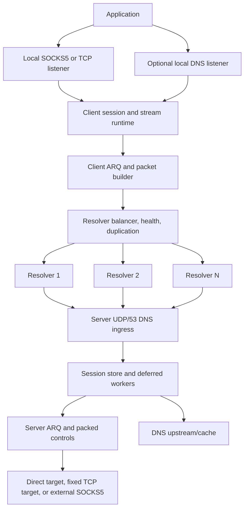
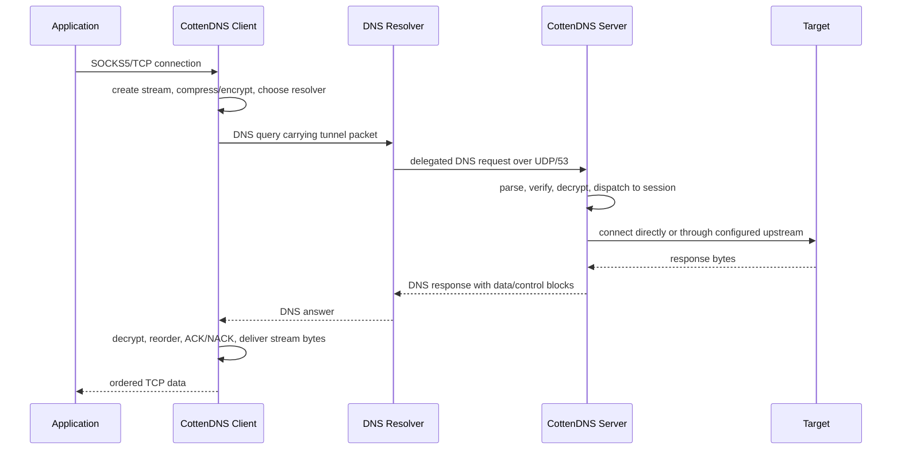

<h1 align="center">⚡ CottenDNS</h1>

<p align="center">
  <strong>A DNS-based TCP tunnel for censored, lossy, high-latency networks.</strong>
</p>

<p align="center">
  <a href="LICENSE"></a>
  
  
  
</p>

<p align="center">
  <a href="README_FA.MD">فارسی</a> ·
  <a href="docs/ENGINEERING_CHANGES.md">Engineering Notes</a> ·
  <a href="https://github.com/TaJirax/cottenpickDNS/releases/latest">Latest Release</a> ·
  <a href="https://t.me/whitedns">Telegram Channel</a>
</p>

CottenDNS is a client/server tunneling system that moves TCP traffic through DNS queries and DNS responses. The client runs on the user's device and exposes a local SOCKS5 proxy or a raw TCP listener. Applications connect to that local listener like they would connect to any normal proxy. CottenDNS then splits each stream into small DNS-safe packets, applies optional compression and encryption, sends packets through one or more DNS resolvers, and reconstructs the stream on the remote CottenDNS server. The server finally opens the real outbound connection directly, through an optional upstream SOCKS5 proxy, or to a fixed TCP target depending on configuration.

The project is built for networks where common circumvention protocols are blocked, throttled, actively probed, or unreliable, but DNS traffic still has a usable path. This includes environments with small resolver payload limits, high latency, unstable resolver behavior, weak upload bandwidth, aggressive rate limits, and frequent packet loss. CottenDNS treats those problems as normal operating conditions: it uses MTU discovery, resolver health checks, multi-resolver balancing, packet duplication, ARQ retransmission, ACK/NACK handling, packet packing, and log-based startup to keep the tunnel usable when the network is hostile.

Typical deployment is straightforward: run the server on a VPS with UDP/53 reachable, delegate a short DNS subdomain to that server, put the generated encryption key and domain into the client config, add working resolvers, then point your browser or application at the local SOCKS5 listener. Advanced deployments can enable tunneled DNS handling, tune resolver/MTU behavior, chain server egress through another SOCKS5 proxy, or run the client as a Linux service.

> [!NOTE]
> DNS tunneling is constrained by resolver payload size, latency, rate limits, and packet loss. CottenDNS is built for usable connectivity under pressure, not for unrealistic benchmark-only claims or replacing a normal VPN on clean, high-bandwidth networks.

## 🆕 What's New

Recent work focused on staying usable on highly restrictive, lossy networks:

- **DNS-over-TCP/53 fallback.** The server serves both UDP/53 and TCP/53 on the same port, and the client (`RESOLVER_TRANSPORT = auto`) probes over UDP first, then transparently re-probes the **whole fleet over TCP/53** if UDP finds no resolvers — surviving networks that filter or truncate UDP/53. Zero cost when UDP works. Every response channel (TXT/CNAME/A/NULL/HTTPS) works over TCP too.
- **TCP survival-path guardrails.** TCP/53 is treated as a first-class fallback path: per-IP connection caps, optional per-connection query limits, read-idle timeouts, and write deadlines protect the listener while keeping persistent DNS-over-TCP useful.
- **Paired config presets.** Bundled client/server pairs (`speed`, `survival`, `tcp-survival`) tune both sides together through `CONFIG_PRESET`, while explicit TOML/CLI values still override the profile.
- **More honest MTU loss reporting.** Loss-aware MTU probing now reports failures against the configured sample budget, so scans can show intermediate loss percentages instead of collapsing early rejects into only `0%` or `100%`.
- **Crypto-grade cheap DNS randomness.** DNS transaction-ID randomization and EDNS client-cookie generation now use `crypto/rand` with fallback, improving spoofing hardness and making query shaping closer to modern resolver behavior.
- **Intelligent rate limiting.** A resolver that signals overload (REFUSED/SERVFAIL or timeouts) is briefly cooled down (AIMD) and its load shifts to resolvers with headroom — redistribution, not a global throttle. It's self-gating (does nothing to healthy resolvers), never idles, and avoids tripping resolver/IP rate-limit blocks.
- **QNAME reshaping.** `QNAME_LABEL_LENGTH` lays the payload into shorter, jittered DNS labels instead of one chain of uniform 63-char labels — a lower-fingerprint knob. Server-transparent (the server reassembles labels regardless), so it can't desync; default keeps maximal capacity.
- **Adaptive per-group MTU.** Instead of forcing the slowest resolver's MTU on everyone, the client runs the session at the throughput-optimal operating point — the MTU that maximizes `MTU × resolvers that sustain it`, jointly over upload and download. Slower resolvers are kept as **reserves** and promoted automatically (with hysteresis) if the active pool degrades.
- **Three explicit resolver states.** MTU testing flags every resolver as **active**, **reserve** (backup/failover), or **invalid**, with a clear `[RESOLVER STATES]` summary in the logs.
- **Loss-triggered FEC.** Download-path Reed-Solomon FEC can turn on automatically per stream once measured loss crosses a threshold, scaling parity to the loss (zero overhead while the link is healthy) — built for very high-loss conditions.
- **More transport channels, accepted by default.** Tunnel responses can ride over **NULL** and **HTTPS/SVCB** records in addition to TXT/CNAME/A; the server auto-accepts whichever query type the client rotates to.
- **MTU-weighted balancing.** A strategy that sends each resolver traffic in proportion to its download MTU.
- **Safer caching & bigger session space.** Log-based fast-start is hybrid (cached resolvers trusted, new/changed ones always re-scanned), and the session ID space was widened to 65535.

## 🧭 Quick Navigation

| Area | Go To |
| --- | --- |
| 🚀 First deployment | [Quick Start](#quick-start), [Server Setup](#server-setup), [Client Setup](#client-setup) |
| 🌐 DNS/domain requirements | [Network And Domain Requirements](#network-and-domain-requirements) |
| ⚙️ Configuration | [Configuration Overview](#configuration-overview), [Current Config Keys](#current-config-keys) |
| 📡 Resolver and MTU tuning | [Resolver, MTU, And Loss Tuning](#resolver-mtu-and-loss-tuning) |
| 🧱 Architecture | [Architecture](#architecture) |
| 🧾 Engineering details | [Engineering Notes](docs/ENGINEERING_CHANGES.md) |
| 🧯 Problems and fixes | [Troubleshooting](#troubleshooting) |
| 🧑‍💻 Development | [Development](#development) |

## 🎯 Built For Hostile Networks

| Network Reality | CottenDNS Response |
| --- | --- |
| 📏 DNS payloads are small | Low protocol overhead, DNS-safe encoding, active MTU discovery |
| 📉 Packet loss is normal | ARQ windows, ACK/NACK, retransmission timers, terminal drain handling, and optional/auto download-path Reed-Solomon FEC |
| 📡 Resolvers degrade or disappear | Health checks, runtime auto-disable, background recheck, stream failover, and reserve resolvers promoted automatically when the active pool shrinks |
| 🚦 Resolvers rate-limit aggressively | Per-resolver adaptive (AIMD) pacing redistributes load off throttling resolvers to ones with headroom, avoiding REFUSED/SERVFAIL and IP blocks |
| ⬆️ Upload is often the bottleneck | Separate duplication controls for data, ACKs, setup, and control packets; upload-aware operating-point selection |
| 🕒 Startup can be expensive | Resolver cache logs with hybrid log-based startup (cached resolvers trusted, new/changed ones re-scanned) |
| 🧪 Resolver behavior is inconsistent | Per-resolver MTU validation, adaptive per-group operating MTU, active/reserve/invalid tiers, and MTU-weighted balancing |
| 🚧 UDP/53 is filtered or truncated | Automatic fallback to DNS-over-TCP/53 (same server port) for the whole tunnel — probe, session, and data plane |
| 🧱 DPI/protocol filtering is common | DNS-only transport over ordinary UDP/53 (or TCP/53) query/response flow, rotating query types (TXT/CNAME/A/NULL/HTTPS/…), type-matched responses, QNAME label reshaping, and duplication spread across multiple domains |
| 🧪 DNS injection/spoofing happens | Randomized query IDs, EDNS client cookies, and injected-NXDOMAIN ignore logic keep working resolvers from being falsely penalized |
| 🔐 Key/method policy varies per client | Server auto-detects the client's encryption method, so a client can change it without server reconfiguration |

## ✨ Main Capabilities

| Category | Capabilities |
| --- | --- |
| 🌐 Transport | DNS tunnel over UDP/53 with automatic DNS-over-TCP/53 fallback (`RESOLVER_TRANSPORT`), delegated tunnel domains, multi-resolver routing |
| 🧦 Local access | SOCKS5 proxy mode and raw TCP forwarding mode |
| 📡 Resolver runtime | Random, round-robin, least-loss, lowest-latency, and MTU-weighted balancing; adaptive per-group operating MTU with active/reserve/invalid tiers; per-resolver adaptive rate-limit pacing (`RESOLVER_RATE_LIMIT_ENABLED`) |
| 🔁 Reliability | ARQ, ACK/NACK, RTO, retry limits, stream cleanup, packed controls; download-path Reed-Solomon FEC, always-on (`FEC_DOWNLOAD_ENABLED`) or loss-triggered/auto (`FEC_AUTO_ENABLED`) |
| 📦 Efficiency | MTU discovery, packet packing, optional base encoding, ZSTD/LZ4/ZLIB |
| 🕵️ Anti-fingerprinting | Query-type rotation (`QUERY_TYPES`), server-accepted-by-default response RR-type matching (TXT→TXT, NULL→NULL, HTTPS/SVCB→service-binding, A→A-records, others→CNAME with TXT fallback), QNAME label reshaping (`QNAME_LABEL_LENGTH`), domain-diverse packet duplication (`DUPLICATION_PREFER_DISTINCT_DOMAINS`) |
| 🔐 Security | None, XOR, ChaCha20, AES-128-GCM, AES-192-GCM, AES-256-GCM; server-side encryption-method auto-detection (`ENCRYPTION_AUTO_DETECT`); crypto-backed DNS query IDs and EDNS cookies |
| 📛 DNS features | Optional client-side local DNS listener/cache and server-side upstream DNS/cache |
| 🧰 Operations | Paired config presets, Linux systemd installers, CLI overrides, cross-platform release workflow |
| 🧪 Testing | Standard Go tests across client, server, ARQ, config, DNS, protocol, and utility packages |

## 🗂️ Repository Map

| Path | Purpose |
| --- | --- |
| `cmd/client` | Client executable entrypoint |
| `cmd/server` | Server executable entrypoint |
| `internal/client` | Client runtime, SOCKS/TCP listeners, resolver balancing, MTU, sessions |
| `internal/udpserver` | Server runtime, DNS ingress, sessions, streams, deferred workers |
| `internal/vpnproto` | CottenDNS packet building, parsing, payloads, control packing |
| `internal/arq` | Reliability window, retransmission, ACK/NACK logic |
| `internal/security` | Encryption codecs and server key generation/loading |
| `internal/compression` | ZSTD, LZ4, and ZLIB integration |
| `internal/basecodec` | DNS-safe encoding helpers: lowerbase32, lowerbase36, rawbase64 |
| `internal/config` | TOML configuration loading, validation, defaults, CLI overrides |
| `internal/dnsparser` | DNS packet parsing and response creation |
| `internal/dnscache` | DNS cache storage |
| `internal/fragmentstore` | Fragment assembly storage |
| `scripts/bench` | Local integration benchmark helper |
| `docs/ENGINEERING_CHANGES.md` | Technical design notes and engineering-change log |
| `.github/workflows/build-go.yml` | Manual release workflow and artifact packaging |

<a id="quick-start"></a>

## 🚀 Quick Start

### 1. Prepare DNS

Create a short delegated subdomain such as `v.example.com` and point it to a nameserver hostname that resolves to your server IP:

```text
ns.example.com  A   1.2.3.4
v.example.com   NS  ns.example.com
```

### 2. Install Server

```bash
bash <(curl -Ls https://raw.githubusercontent.com/TaJirax/cottenpickDNS/main/server_linux_install.sh)
```

After startup, the server prints the active encryption key and writes it to `encrypt_key.txt`.

### 3. Configure Client

Set at least these values in `client_config.toml`:

```toml
DOMAINS = ["v.example.com"]
DATA_ENCRYPTION_METHOD = 1
ENCRYPTION_KEY = "paste-server-key-here"
PROTOCOL_TYPE = "SOCKS5"
LISTEN_IP = "127.0.0.1"
LISTEN_PORT = 18000
STARTUP_MODE = "resolvers"
```

Add resolvers to `client_resolvers.txt`:

```text
8.8.8.8
1.1.1.1:53
9.9.9.9
192.0.2.0/30
[2001:4860:4860::8888]:53
```

### 4. Run Client

```bash
./CottenDNS_Client_Linux_AMD64 --config client_config.toml
```

Then configure your browser or app:

```text
SOCKS5 127.0.0.1:18000
```

<a id="network-and-domain-requirements"></a>

## 🌐 Network And Domain Requirements

You need:

| Requirement | Notes |
| --- | --- |
| 🌍 Public server | A VPS or server with a public IPv4 address |
| 📡 UDP/53 reachability | Public resolvers must be able to reach your server on UDP port `53` |
| 🧩 Delegated domain | A domain/subdomain you can delegate with an `NS` record |
| 🔑 Shared key | Server-generated key copied into the client config |
| 📋 Resolver list | `client_resolvers.txt`, one resolver or CIDR per line |
| 🧪 MTU scan | The client must be able to test real resolver/domain paths |

### 🧩 DNS Delegation Details

Example DNS records:

```text
ns.example.com  A   1.2.3.4
v.example.com   NS  ns.example.com
```

Use the delegated tunnel domain in both configs:

```toml
# server_config.toml
DOMAIN = ["v.example.com"]

# client_config.toml
DOMAINS = ["v.example.com"]
```

If your DNS provider is Cloudflare, the `A` record for `ns.example.com` must be **DNS only**. It must not be proxied.

Short labels matter. A shorter domain leaves more room for payload inside the DNS query name, which is important on resolvers with tight limits.

<a id="server-setup"></a>

## 🖥️ Server Setup

### 🐧 Linux Installer

Run on the remote Linux server:

```bash
bash <(curl -Ls https://raw.githubusercontent.com/TaJirax/cottenpickDNS/main/server_linux_install.sh)
```

The installer:

| Step | What It Does |
| --- | --- |
| 📦 Download | Downloads the correct release artifact unless `--local` is used |
| 🧾 Config | Prepares `server_config.toml` and asks for a domain if the sample value is unchanged |
| 🚪 Port 53 | Attempts to free local port `53` and stop conflicting DNS services |
| 🔥 Firewall | Opens DNS port `53` where supported by the host firewall tool |
| ⚙️ Tuning | Applies UDP, socket buffer, file descriptor, and systemd limits |
| 🔑 Key | Starts the server once to generate `encrypt_key.txt` |
| 🧰 Service | Installs and starts the `cottenpickdns` systemd service |
| 🧱 Egress filter | Rejects outbound TCP/53 to avoid incorrect TCP DNS behavior |

Installer options:

| Option | Description |
| --- | --- |
| `--version <TAG>` | Install a specific release tag instead of latest |
| `--local` | Use a local server binary/config from the current directory or `dist/` |
| `--uninstall` | Remove the service, tuning files, binary, config, and key from the install directory |
| `--help` | Show installer usage |

Examples:

```bash
bash <(curl -Ls https://raw.githubusercontent.com/TaJirax/cottenpickDNS/main/server_linux_install.sh) --version vYYYY.MM.DD.HHMMSS-abcdef0
sudo bash server_linux_install.sh --local
bash <(curl -Ls https://raw.githubusercontent.com/TaJirax/cottenpickDNS/main/server_linux_install.sh) --uninstall
```

Useful service commands:

```bash
systemctl status cottenpickdns
journalctl -u cottenpickdns -f
systemctl restart cottenpickdns
systemctl stop cottenpickdns
```

The deployed `server_config.toml` ships with these optional knobs (all safe defaults; edit and `systemctl restart cottenpickdns` to apply):

| Key | Default | Purpose |
| --- | --- | --- |
| `CONFIG_PRESET` | `default` | Optional paired profile: `speed`, `survival`, or `tcp-survival` |
| `TCP_LISTENER_ENABLED` | `true` | Serve DNS-over-TCP/53 on the same host:port as UDP/53 |
| `TCP_MAX_CONNS_PER_IP` | `128` | Cap concurrent TCP/53 connections from one client IP |
| `TCP_MAX_QUERIES_PER_CONN` | `0` | Optional per-connection query cap; `0` means unlimited persistent TCP |
| `ENCRYPTION_AUTO_DETECT` | `true` | Accept whichever encryption method the client uses (trial-decrypt) without reconfiguring the server |
| `A_RECORD_DATA_DELIVERY` | `false` | Answer `A`-type tunnel queries with IPv4 A-record data (supplementary channel) |
| `FEC_AUTO_ENABLED` | `true` | Turn download FEC on automatically once a stream shows loss |
| `FEC_DOWNLOAD_ENABLED` | `false` | Reed-Solomon FEC on the download path for high-loss links; pair with `FEC_BLOCK_SIZE`/`FEC_PARITY` (e.g. `4`/`12` to ride out ~75% loss) |

NULL and HTTPS/SVCB response channels need no server config — the server auto-accepts every query type the client rotates over (`QUERY_TYPES`) and answers with the matching record.

### 🧪 Manual Server Run

```bash
./CottenDNS_Server_Linux_AMD64 --config server_config.toml
```

Useful server flags:

```text
--config <path>       path to server configuration file, default server_config.toml
--log <path>          optional log file path
--version             print version and exit
```

Every TOML key can be overridden using a lower-case dashed flag generated from the TOML key:

```bash
./CottenDNS_Server_Linux_AMD64 --config server_config.toml --udp-port 5353 --log-level DEBUG
```

<a id="client-setup"></a>

## 🧑‍💻 Client Setup

Download the client archive for your platform from:

```text
https://github.com/TaJirax/cottenpickDNS/releases/latest
```

Client release archives include:

| File | Purpose |
| --- | --- |
| `CottenDNS_Client_*` | Client executable |
| `client_config.toml` | Client config template |
| `client_config.speed.toml` / `client_config.survival.toml` / `client_config.tcp-survival.toml` | Paired client presets |
| `client_resolvers.txt` | Resolver list template |
| `CONFIG_PRESETS.md` | Preset selection notes |
| `client_linux_install.sh` | Linux systemd installer, Linux archives only |

Minimum client edits:

```toml
DOMAINS = ["v.example.com"]
DATA_ENCRYPTION_METHOD = 1
ENCRYPTION_KEY = "paste-server-key-here"
PROTOCOL_TYPE = "SOCKS5"
LISTEN_IP = "127.0.0.1"
LISTEN_PORT = 18000
STARTUP_MODE = "resolvers"
```

Run manually:

```bash
./CottenDNS_Client_Linux_AMD64 --config client_config.toml
```

Windows example:

```powershell
.\CottenDNS_Client_Windows_AMD64.exe --config client_config.toml
```

Useful client flags:

```text
--config <path>       path to client configuration file, default client_config.toml
--resolvers <path>    resolver file override
--version             print version and exit
```

CLI override example:

```bash
./CottenDNS_Client_Linux_AMD64 --config client_config.toml --listen-port 18001 --startup-mode logs
```

### 🐧 Linux Client Service

From the extracted client release directory:

```bash
sudo bash client_linux_install.sh
```

Service commands:

```bash
systemctl status cottenpickdns-client
journalctl -u cottenpickdns-client -f
systemctl restart cottenpickdns-client
```

The client service runs non-interactively. If the config still has `STARTUP_MODE = "ask"`, the installer changes it to `logs`.

<a id="configuration-overview"></a>

## ⚙️ Configuration Overview

CottenDNS uses TOML configuration files. There are no environment-variable configuration paths. Runtime paths are resolved relative to the executable/config location through `internal/runtimepath` and config helpers.

### 🔐 Values That Must Match

| Meaning | Client | Server | Notes |
| --- | --- | --- | --- |
| Tunnel domain | `DOMAINS` | `DOMAIN` | Must point to the server through DNS delegation |
| Encryption method | `DATA_ENCRYPTION_METHOD` | `DATA_ENCRYPTION_METHOD` | Need not match when the server has `ENCRYPTION_AUTO_DETECT = true` (default): the server detects the client's method automatically. The server value is just the method it tries first. |
| Encryption key | `ENCRYPTION_KEY` | contents of `ENCRYPTION_KEY_FILE` | Must match. Server creates/loads the key file; one key works across all methods. |

### 🧭 Paired Presets

For common network conditions, use matching client/server files from the release archive:

| Preset | Pair | Use When |
| --- | --- | --- |
| `speed` | `client_config.speed.toml` + `server_config.speed.toml` | DNS path is usable and you want lower duplicate traffic plus higher throughput |
| `survival` | `client_config.survival.toml` + `server_config.survival.toml` | UDP/53 works but the network is lossy, restrictive, or unstable |
| `tcp-survival` | `client_config.tcp-survival.toml` + `server_config.tcp-survival.toml` | TCP/53 is the main reliable path |

The underlying key is `CONFIG_PRESET`. Presets are a base layer only: any explicit TOML value or CLI override still wins.

### 🔒 Encryption Methods

| ID | Method | Practical Notes |
| --- | --- | --- |
| `0` | None | Local testing only |
| `1` | XOR | Very low overhead, weak security |
| `2` | ChaCha20 | Good stream cipher choice when overhead is acceptable |
| `3` | AES-128-GCM | Authenticated encryption |
| `4` | AES-192-GCM | Authenticated encryption |
| `5` | AES-256-GCM | Authenticated encryption |

With `ENCRYPTION_AUTO_DETECT = true` (server default) the server builds a codec for every method from the shared key and detects which one each client used by trying to decrypt. Authenticated (AES-GCM) methods are tried first, so they can never be mis-detected by an unauthenticated codec. This lets clients change `DATA_ENCRYPTION_METHOD` without touching the server. Set it to `false` to accept only the configured method.

### 🕵️ DNS Anti-Fingerprinting

| Feature | Key (side) | Behavior |
| --- | --- | --- |
| Query-type rotation | `QUERY_TYPES` (client) | Rotates the DNS record type per query over a configurable set (e.g. `["TXT","CNAME","NULL","HTTPS"]`); payload always rides in the query name, so the server accepts any of them. Unset = TXT only. |
| Response type matching | automatic (server) | TXT queries get TXT answers, NULL gets NULL RDATA, HTTPS/SVCB gets service-binding data, A can use A-record delivery, and CNAME/other types use CNAME with TXT fallback when needed. |
| DNS query shaping | `DNS_RANDOMIZE_QUERY_ID`, `DNS_EDNS_COOKIE`, `DNS_QNAME_CASE_RANDOMIZATION`, `EDNS_UDP_SIZE` (client) | Randomizes transaction IDs, can add EDNS client cookies, optionally applies 0x20 mixed-case QNAMEs, and controls advertised EDNS UDP size. Server-transparent. |
| Injection hardening | `RESOLVER_IGNORE_INJECTED_NXDOMAIN` (client) | Ignores forged payloadless NXDOMAIN responses for resolver scoring so a censor cannot cheaply disable working resolvers. |
| Domain-diverse duplication | `DUPLICATION_PREFER_DISTINCT_DOMAINS` (client) | Sends the duplicate copies of a packet across distinct tunnel domains where possible, for independent delivery paths and spread query volume. No effect with a single domain or duplication count `1`. |

### 📦 Compression Methods

| ID | Method | Practical Notes |
| --- | --- | --- |
| `0` | OFF | No compression |
| `1` | ZSTD | Better ratio, more CPU |
| `2` | LZ4 | Fast and practical default for weak devices |
| `3` | ZLIB | Compatibility-oriented option |

### 📡 Resolver Balancing Strategies

| ID | Strategy | Notes |
| --- | --- | --- |
| `1` | Random | Simple distribution |
| `2` | Round-robin | Even rotation |
| `3` | Least loss | Uses runtime feedback to avoid lossy paths |
| `4` | Lowest latency | Uses runtime feedback to prefer faster paths |
| `5` | MTU-weighted | Sends more traffic to active resolvers with larger measured download MTU |

### 🚦 Startup Modes

| Value | Behavior |
| --- | --- |
| `ask` | Prompt interactively; auto-selects resolver scan after 10 seconds |
| `resolvers` | Always scan `client_resolvers.txt` and test MTU |
| `logs` | Start from previous `resolver_cache_*.log` files, fall back to resolver scan if needed |

<a id="current-config-keys"></a>

## 📚 Current Config Keys

The sample files are the source of truth for defaults and operational comments:

| File | Purpose |
| --- | --- |
| `client_config.toml.simple` | Current client config template |
| `server_config.toml.simple` | Current server config template |
| `client_config.*.toml` / `server_config.*.toml` | Paired preset configs (`speed`, `survival`, `tcp-survival`) |
| `CONFIG_PRESETS.md` | Preset selection notes |
| `client_resolvers.simple` | Resolver list example |

### 📘 Client Config Key Groups

| Group | Keys |
| --- | --- |
| 🧭 Presets | `CONFIG_PRESET` |
| 🪪 Tunnel identity/security | `DOMAINS`, `DATA_ENCRYPTION_METHOD`, `ENCRYPTION_KEY`, `QUERY_TYPES`, `DNS_RANDOMIZE_QUERY_ID`, `DNS_EDNS_COOKIE`, `DNS_QNAME_CASE_RANDOMIZATION`, `EDNS_UDP_SIZE`, `RESOLVER_IGNORE_INJECTED_NXDOMAIN` |
| 🧦 Local proxy | `PROTOCOL_TYPE`, `LISTEN_IP`, `LISTEN_PORT`, `SOCKS5_AUTH`, `SOCKS5_USER`, `SOCKS5_PASS` |
| 📛 Local DNS | `LOCAL_DNS_ENABLED`, `LOCAL_DNS_IP`, `LOCAL_DNS_PORT`, `LOCAL_DNS_CACHE_MAX_RECORDS`, `LOCAL_DNS_CACHE_TTL_SECONDS`, `LOCAL_DNS_PENDING_TIMEOUT_SECONDS`, `DNS_RESPONSE_FRAGMENT_TIMEOUT_SECONDS`, `LOCAL_DNS_CACHE_PERSIST_TO_FILE`, `LOCAL_DNS_CACHE_FLUSH_INTERVAL_SECONDS` |
| 📡 Resolver/loss handling | `RESOLVER_TRANSPORT`, `RESOLVER_BALANCING_STRATEGY`, `RESOLVER_RATE_LIMIT_ENABLED`, `UPLOAD_PACKET_DUPLICATION_COUNT`, `DOWNLOAD_PACKET_DUPLICATION_COUNT`, `UPLOAD_SETUP_PACKET_DUPLICATION_COUNT`, `DOWNLOAD_SETUP_PACKET_DUPLICATION_COUNT`, `STREAM_RESOLVER_FAILOVER_RESEND_THRESHOLD`, `STREAM_RESOLVER_FAILOVER_COOLDOWN`, `RECHECK_INACTIVE_SERVERS_ENABLED`, `RECHECK_INACTIVE_INTERVAL_SECONDS`, `RECHECK_SERVER_INTERVAL_SECONDS`, `RECHECK_BATCH_SIZE`, `AUTO_DISABLE_TIMEOUT_SERVERS`, `AUTO_DISABLE_TIMEOUT_WINDOW_SECONDS`, `AUTO_DISABLE_MIN_OBSERVATIONS`, `AUTO_DISABLE_CHECK_INTERVAL_SECONDS`, `BASE_ENCODE_DATA`, `DUPLICATION_PREFER_DISTINCT_DOMAINS`, `ADAPTIVE_DUPLICATION`, `ADAPTIVE_DUPLICATION_TARGET_DELIVERY` |
| 📦 Compression | `UPLOAD_COMPRESSION_TYPE`, `DOWNLOAD_COMPRESSION_TYPE`, `COMPRESSION_MIN_SIZE` |
| 📏 MTU discovery | `MIN_UPLOAD_MTU`, `MIN_DOWNLOAD_MTU`, `MAX_UPLOAD_MTU`, `MAX_DOWNLOAD_MTU`, `MTU_TEST_RETRIES_RESOLVERS`, `MTU_TEST_TIMEOUT_RESOLVERS`, `MTU_TEST_PARALLELISM_RESOLVERS`, `MTU_TEST_RETRIES_LOGS`, `MTU_TEST_TIMEOUT_LOGS`, `MTU_TEST_PARALLELISM_LOGS`, `MTU_PROBE_SAMPLES`, `MTU_MAX_LOSS`, `MTU_GROUP_GAP_RATIO`, `MTU_ADAPTIVE_GROUPING` |
| ⚙️ Workers/queues/timers | `RX_TX_WORKERS`, `TUNNEL_PROCESS_WORKERS`, `TUNNEL_PACKET_TIMEOUT_SECONDS`, `DISPATCHER_IDLE_POLL_INTERVAL_SECONDS`, `TX_CHANNEL_SIZE`, `RX_CHANNEL_SIZE`, `RESOLVER_UDP_CONNECTION_POOL_SIZE`, `STREAM_QUEUE_INITIAL_CAPACITY`, `ORPHAN_QUEUE_INITIAL_CAPACITY`, `DNS_RESPONSE_FRAGMENT_STORE_CAPACITY`, `SOCKS_UDP_ASSOCIATE_READ_TIMEOUT_SECONDS`, `CLIENT_TERMINAL_STREAM_RETENTION_SECONDS`, `CLIENT_CANCELLED_SETUP_RETENTION_SECONDS` |
| 🔄 Session init/ping | `SESSION_INIT_RETRY_BASE_SECONDS`, `SESSION_INIT_RETRY_STEP_SECONDS`, `SESSION_INIT_RETRY_LINEAR_AFTER`, `SESSION_INIT_RETRY_MAX_SECONDS`, `SESSION_INIT_BUSY_RETRY_INTERVAL_SECONDS`, `PING_AGGRESSIVE_INTERVAL_SECONDS`, `PING_LAZY_INTERVAL_SECONDS`, `PING_COOLDOWN_INTERVAL_SECONDS`, `PING_COLD_INTERVAL_SECONDS`, `PING_WARM_THRESHOLD_SECONDS`, `PING_COOL_THRESHOLD_SECONDS`, `PING_COLD_THRESHOLD_SECONDS`, `PING_WATCHDOG_TIMEOUT_SECONDS` |
| 🔁 ARQ/packing | `MAX_PACKETS_PER_BATCH`, `ARQ_WINDOW_SIZE`, `ARQ_INITIAL_RTO_SECONDS`, `ARQ_MAX_RTO_SECONDS`, `ARQ_CONTROL_INITIAL_RTO_SECONDS`, `ARQ_CONTROL_MAX_RTO_SECONDS`, `ARQ_MAX_CONTROL_RETRIES`, `ARQ_INACTIVITY_TIMEOUT_SECONDS`, `ARQ_DATA_PACKET_TTL_SECONDS`, `ARQ_CONTROL_PACKET_TTL_SECONDS`, `ARQ_MAX_DATA_RETRIES`, `ARQ_DATA_NACK_MAX_GAP`, `ARQ_DATA_NACK_INITIAL_DELAY_SECONDS`, `ARQ_DATA_NACK_REPEAT_SECONDS`, `ARQ_TERMINAL_DRAIN_TIMEOUT_SECONDS`, `ARQ_TERMINAL_ACK_WAIT_TIMEOUT_SECONDS` |
| 📝 Logging/startup | `LOG_LEVEL`, `LOG_TO_FILE`, `LOG_DIR`, `LOG_FILE_NAME`, `STATS_REPORT_INTERVAL_SECONDS`, `STARTUP_MODE`, `LOG_SCAN_MAX_DAYS`, `LOG_SCAN_MAX_RESOLVERS`, `LOG_BASED_MTU_VERIFY`, `CONFIG_VERSION` |

### 📗 Server Config Key Groups

| Group | Keys |
| --- | --- |
| 🧭 Presets | `CONFIG_PRESET` |
| 🪪 Tunnel policy | `DOMAIN`, `PROTOCOL_TYPE`, `SUPPORTED_UPLOAD_COMPRESSION_TYPES`, `SUPPORTED_DOWNLOAD_COMPRESSION_TYPES`, `MIN_VPN_LABEL_LENGTH`, `A_RECORD_DATA_DELIVERY` |
| 🚪 UDP/TCP listener/capacity | `UDP_HOST`, `UDP_PORT`, `UDP_READERS`, `TCP_LISTENER_ENABLED`, `TCP_MAX_CONNS`, `TCP_MAX_CONNS_PER_IP`, `TCP_MAX_QUERIES_PER_CONN`, `TCP_READ_IDLE_TIMEOUT_SECONDS`, `TCP_WRITE_TIMEOUT_SECONDS`, `DNS_REQUEST_WORKERS`, `MAX_CONCURRENT_REQUESTS`, `SOCKET_BUFFER_SIZE`, `MAX_PACKET_SIZE`, `DROP_LOG_INTERVAL_SECONDS` |
| 🧵 Deferred runtime/queues | `DEFERRED_SESSION_WORKERS`, `DEFERRED_SESSION_QUEUE_LIMIT`, `SESSION_ORPHAN_QUEUE_INITIAL_CAPACITY`, `STREAM_QUEUE_INITIAL_CAPACITY`, `DNS_FRAGMENT_STORE_CAPACITY`, `SOCKS5_FRAGMENT_STORE_CAPACITY`, `MAX_STREAMS_PER_SESSION`, `MAX_DNS_RESPONSE_BYTES` |
| 🧹 Session lifecycle | `INVALID_COOKIE_WINDOW_SECONDS`, `INVALID_COOKIE_ERROR_THRESHOLD`, `SESSION_TIMEOUT_SECONDS`, `SESSION_CLEANUP_INTERVAL_SECONDS`, `CLOSED_SESSION_RETENTION_SECONDS`, `SESSION_INIT_REUSE_TTL_SECONDS`, `RECENTLY_CLOSED_STREAM_TTL_SECONDS`, `RECENTLY_CLOSED_STREAM_CAP`, `TERMINAL_STREAM_RETENTION_SECONDS` |
| 📛 DNS upstream/cache | `DNS_UPSTREAM_SERVERS`, `DNS_UPSTREAM_TIMEOUT`, `DNS_INFLIGHT_WAIT_TIMEOUT_SECONDS`, `DNS_FRAGMENT_ASSEMBLY_TIMEOUT`, `DNS_CACHE_MAX_RECORDS`, `DNS_CACHE_TTL_SECONDS` |
| 🌍 Outbound path | `SOCKS_CONNECT_TIMEOUT`, `USE_EXTERNAL_SOCKS5`, `SOCKS5_AUTH`, `SOCKS5_USER`, `SOCKS5_PASS`, `FORWARD_IP`, `FORWARD_PORT` |
| 🔐 Security | `DATA_ENCRYPTION_METHOD`, `ENCRYPTION_AUTO_DETECT`, `ENCRYPTION_KEY_FILE` |
| 📉 Download FEC | `FEC_DOWNLOAD_ENABLED`, `FEC_BLOCK_SIZE`, `FEC_PARITY`, `FEC_AUTO_ENABLED`, `FEC_AUTO_LOSS_THRESHOLD`, `FEC_AUTO_MAX_PARITY` |
| 🔁 ARQ/packing | `MAX_PACKETS_PER_BATCH`, `PACKET_BLOCK_CONTROL_DUPLICATION`, `STREAM_SETUP_ACK_TTL_SECONDS`, `STREAM_RESULT_PACKET_TTL_SECONDS`, `STREAM_FAILURE_PACKET_TTL_SECONDS`, `ARQ_WINDOW_SIZE`, `ARQ_INITIAL_RTO_SECONDS`, `ARQ_MAX_RTO_SECONDS`, `ARQ_CONTROL_INITIAL_RTO_SECONDS`, `ARQ_CONTROL_MAX_RTO_SECONDS`, `ARQ_MAX_CONTROL_RETRIES`, `ARQ_INACTIVITY_TIMEOUT_SECONDS`, `ARQ_DATA_PACKET_TTL_SECONDS`, `ARQ_CONTROL_PACKET_TTL_SECONDS`, `ARQ_MAX_DATA_RETRIES`, `ARQ_DATA_NACK_MAX_GAP`, `ARQ_DATA_NACK_INITIAL_DELAY_SECONDS`, `ARQ_DATA_NACK_REPEAT_SECONDS`, `ARQ_TERMINAL_DRAIN_TIMEOUT_SECONDS`, `ARQ_TERMINAL_ACK_WAIT_TIMEOUT_SECONDS` |
| 📝 Logging/metadata | `LOG_LEVEL`, `CONFIG_VERSION` |

### 🌍 Server Outbound Modes

| Mode | Behavior |
| --- | --- |
| `PROTOCOL_TYPE = "SOCKS5"`, `USE_EXTERNAL_SOCKS5 = false` | Server connects directly to destinations requested by client SOCKS5 requests |
| `PROTOCOL_TYPE = "SOCKS5"`, `USE_EXTERNAL_SOCKS5 = true` | Server connects to `FORWARD_IP:FORWARD_PORT` as an upstream SOCKS5 proxy |
| `PROTOCOL_TYPE = "TCP"` | Server forwards every stream to fixed target `FORWARD_IP:FORWARD_PORT` |

<a id="resolver-mtu-and-loss-tuning"></a>

## 📡 Resolver, MTU, And Loss Tuning

Resolver choice determines whether CottenDNS is usable. A resolver may work for ordinary DNS but fail for tunnel-sized labels, repeated queries, long names, or resolver-specific rate limits. Always let the client test your real resolver/domain path.

### 🧪 Practical Resolver Workflow

1. Start with the sample configs.
2. Add many candidate resolvers to `client_resolvers.txt`.
3. Run with `STARTUP_MODE = "resolvers"` for a full scan.
4. Keep `LOG_TO_FILE = true` so working resolver/MTU results are saved.
5. After a successful scan, switch to `STARTUP_MODE = "logs"` for faster startup.

```toml
STARTUP_MODE = "resolvers"
LOG_TO_FILE = true
RESOLVER_BALANCING_STRATEGY = 3
```

After a successful scan:

```toml
STARTUP_MODE = "logs"
LOG_BASED_MTU_VERIFY = true
```

### 📏 MTU Range Tuning

If startup takes too long, reduce the search range:

```toml
MIN_UPLOAD_MTU = 80
MAX_UPLOAD_MTU = 180
MIN_DOWNLOAD_MTU = 700
MAX_DOWNLOAD_MTU = 2500
```

If many resolvers fail, lower the minimums. If the tunnel is stable but slow, raise the maximums gradually and retest.

For resolver discovery with small probes and high parallelism:

```toml
STARTUP_MODE = "resolvers"
MIN_UPLOAD_MTU = 30
MAX_UPLOAD_MTU = 30
MIN_DOWNLOAD_MTU = 40
MAX_DOWNLOAD_MTU = 40
MTU_TEST_RETRIES_RESOLVERS = 1
MTU_TEST_TIMEOUT_RESOLVERS = 1.0
MTU_TEST_PARALLELISM_RESOLVERS = 200
```

### 📉 Duplication Guidance

Duplication improves delivery probability but increases DNS query volume. On weak upload links, duplicate small ACK/control packets more aggressively than bulk upload data.

Common lossy-network profile:

```toml
UPLOAD_PACKET_DUPLICATION_COUNT = 1
DOWNLOAD_PACKET_DUPLICATION_COUNT = 4
UPLOAD_SETUP_PACKET_DUPLICATION_COUNT = 2
DOWNLOAD_SETUP_PACKET_DUPLICATION_COUNT = 4
```

If upload is extremely weak, keep `UPLOAD_PACKET_DUPLICATION_COUNT` at `1`. If downloads stall, try increasing `DOWNLOAD_PACKET_DUPLICATION_COUNT` and `DOWNLOAD_SETUP_PACKET_DUPLICATION_COUNT` first.

### 📦 Compression Guidance

| Traffic Type | Suggested Compression |
| --- | --- |
| Weak CPU/device | LZ4 (`2`) |
| Compressible text/API traffic | ZSTD (`1`) or LZ4 (`2`) |
| Already-compressed traffic | OFF (`0`) or LZ4 (`2`) |
| Unstable low-bandwidth path | LZ4 (`2`) |

Compression does not help much with already-compressed data such as most video, archives, and modern HTTPS payloads.

<a id="architecture"></a>

## 🧱 Architecture



Packet flow:



## 📱 Mobile And LAN Usage

There is no official mobile app in this repository.

Usable options:

| Option | Description |
| --- | --- |
| 🖥️ LAN proxy | Run the client on a computer and let phones use it as SOCKS5 over LAN |
| 📦 Router/VPS client | Run the client on a router, mini PC, or VPS and point devices at it |
| 📱 Termux | Use Termux artifacts where supported by the release matrix |
| 🔗 Chaining | Chain another local proxy/panel into the CottenDNS SOCKS5 listener |

If another device must connect to the client over LAN:

```toml
LISTEN_IP = "0.0.0.0"
SOCKS5_AUTH = true
SOCKS5_USER = "choose-a-user"
SOCKS5_PASS = "choose-a-strong-password"
```

Do not expose an unauthenticated SOCKS5 listener to the internet.

## 🏷️ Release And Artifact Names

Release tags are generated by CI in this form:

```text
vYYYY.MM.DD.HHMMSS-commithash
```

Artifacts follow this pattern:

```text
CottenDNS_Client_<Platform>_<ARCH>.zip
CottenDNS_Client_<Platform>_<ARCH>.tar.gz
CottenDNS_Server_<Platform>_<ARCH>.zip
CottenDNS_Server_<Platform>_<ARCH>.tar.gz
```

The GitHub Actions release matrix includes Windows, Linux, Linux-Legacy, macOS, and Termux/Android targets. Client packages include the executable, `client_config.toml`, paired `client_config.*.toml` presets, `client_resolvers.txt`, and `CONFIG_PRESETS.md`. Linux client packages also include `client_linux_install.sh`. Server packages include the executable, `server_config.toml`, paired `server_config.*.toml` presets, and `CONFIG_PRESETS.md`.

<a id="development"></a>

## 🧑‍💻 Development

Requirements:

| Tool | Use |
| --- | --- |
| Go `1.25.0` | Build and test |
| Git | Version metadata and normal development |
| Python 3 | Optional local multi-target build helper |

Build current platform:

```bash
go build ./cmd/client
go build ./cmd/server
```

Run from source-built binaries:

```bash
./client --config client_config.toml
./server --config server_config.toml
```

Run checks:

```bash
go test ./...
go vet ./...
```

Targeted tests:

```bash
go test -v -run TestName ./internal/client
go test -race ./internal/client ./internal/udpserver
```

Local multi-target build:

```bash
python build.py
```

`build.py` writes binaries and README/config copies to `dist/`. The full GitHub Actions release workflow builds a larger platform/architecture matrix and creates release assets manually through `workflow_dispatch`.

## 🧯 Troubleshooting

### 🌐 Server Does Not Receive Traffic

Check DNS delegation and UDP reachability:

```bash
dig v.example.com NS
dig @ns.example.com v.example.com A
```

Also verify that UDP/53 is open in the server firewall and hosting-provider firewall, and that the nameserver record is not proxied.

### 🚧 Port 53 Is Already In Use

On many Linux systems, `systemd-resolved` binds local port `53`. The installer tries to handle this. Manual fix:

```bash
sudo nano /etc/systemd/resolved.conf
```

Set:

```text
DNSStubListener=no
```

Then:

```bash
sudo systemctl restart systemd-resolved
```

Only one DNS service can listen on the same IP/port at the same time.

### 🕒 Client Starts Slowly

Use `STARTUP_MODE = "logs"` after one successful full scan, reduce MTU search ranges, lower `MTU_TEST_RETRIES_RESOLVERS`, and remove consistently failing resolvers from `client_resolvers.txt`.

### 🧊 Tunnel Connects But Websites Stall

Lower upload and download MTU, increase download ACK/control duplication, try `RESOLVER_BALANCING_STRATEGY = 3`, and test resolvers from different networks.

### 🧦 SOCKS Works Locally But Not From Another Device

Set `LISTEN_IP = "0.0.0.0"`, open the client machine firewall for `LISTEN_PORT`, enable SOCKS5 authentication, and connect to the client machine's LAN IP from the other device.

### 🔑 Client Fails With Missing Key

The client requires `ENCRYPTION_KEY`. Copy the exact value from the server's `encrypt_key.txt` or from the server startup log line that prints the active encryption key.

### 🧾 Config Changes Do Not Apply

Restart the relevant process/service after editing TOML files:

```bash
systemctl restart cottenpickdns
systemctl restart cottenpickdns-client
```

## 🛡️ Security And Responsibility

CottenDNS is provided as-is, without warranty. You are responsible for how you deploy it, which networks you use it on, and whether that usage is legal in your jurisdiction.

Operational safety notes:

| Rule | Reason |
| --- | --- |
| 🔑 Keep `encrypt_key.txt` private | Anyone with the key and domain can attempt to speak the tunnel protocol |
| 🧦 Do not expose unauthenticated SOCKS5 | It can become an open proxy |
| 🧭 Prefer `127.0.0.1` for listeners | Limits exposure to the local machine |
| 🔥 Open only required firewall ports | Public server needs DNS port `53`; client usually does not need public inbound access |
| 📊 Monitor logs under heavy loss | Resolver behavior changes over time |
| 🧱 Do not run another DNS server on the same port | CottenDNS server needs UDP/53 for delegated tunnel traffic |

## 🤝 Contributing

Bug reports, focused performance improvements, protocol fixes, tests, and documentation updates are welcome.

Before submitting code, run:

```bash
go test ./...
go vet ./...
```

Project links:

| Resource | Link |
| --- | --- |
| Issues | <https://github.com/TaJirax/cottenpickDNS/issues> |
| Pull requests | <https://github.com/TaJirax/cottenpickDNS/pulls> |
| Telegram | <https://t.me/whitedns> |

## 📄 License

CottenDNS is an independent fork/derivative in the MasterDnsVPN family. This
repository is maintained by `tajirax`; it preserves credit to the upstream Null
Route work this fork came from and to the original Master DNS / MasterDnsVPN
project.

Project lineage:

| Item | Value |
| --- | --- |
| Original project | Master DNS / MasterDnsVPN |
| Original author | Amin Mahmoudi |
| Upstream fork/source | Null Route / NullRoute1970 |
| Current fork | CottenDNS / CottenpickDNS |
| Current maintainer | tajirax |
| License | MIT License |

CottenDNS modifications:

| Item | Value |
| --- | --- |
| Maintainer | tajirax |
| License | MIT License |

This project preserves the MIT License terms of the original project and adds independent modifications under the same license. See [LICENSE](LICENSE).
