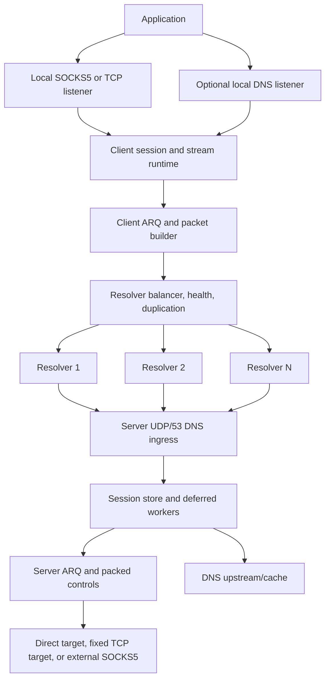
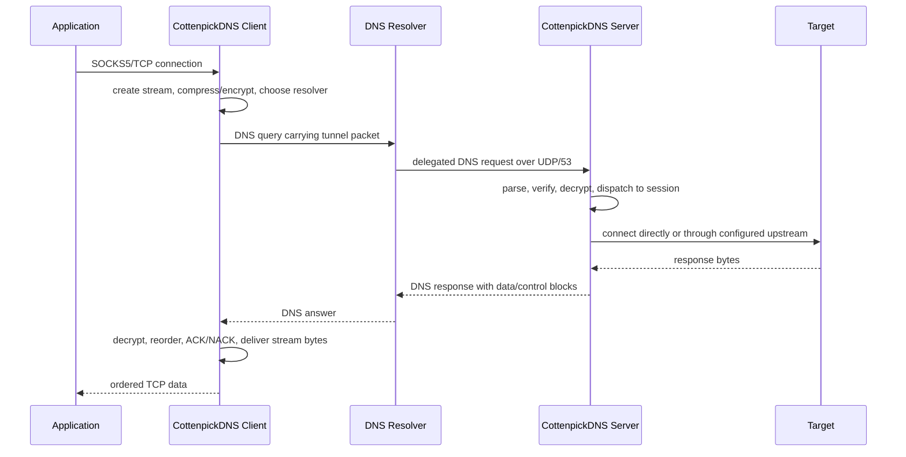

<h1 align="center">⚡ CottenpickDNS</h1>

<p align="center">
  <strong>تونل TCP مبتنی بر DNS برای شبکه‌های فیلترشده، پر packet loss و پر latency.</strong>
</p>

<p align="center">
  <a href="LICENSE"></a>
  
  
  
</p>

<p align="center">
  <a href="README.MD">English</a> ·
  <a href="https://github.com/TaJirax/cottenpickDNS/releases/latest">آخرین Release</a> ·
  <a href="https://t.me/nulllroute1970">کانال تلگرام</a>
</p>

CottenpickDNS یک سیستم تونل client/server است که ترافیک TCP را از طریق query و responseهای DNS جابه‌جا می‌کند. کلاینت روی دستگاه کاربر اجرا می‌شود و یک SOCKS5 proxy محلی یا raw TCP listener ارائه می‌دهد. برنامه‌ها مثل یک proxy معمولی به این listener محلی وصل می‌شوند. سپس CottenpickDNS هر stream را به packetهای کوچک و سازگار با DNS تقسیم می‌کند، در صورت نیاز compression و encryption اعمال می‌کند، packetها را از طریق یک یا چند DNS resolver می‌فرستد و در سمت سرور CottenpickDNS stream را بازسازی می‌کند. سرور در پایان اتصال واقعی را مستقیم، از طریق SOCKS5 upstream اختیاری، یا به یک مقصد TCP ثابت باز می‌کند.

این پروژه برای شبکه‌هایی ساخته شده که پروتکل‌های رایج دورزدن محدودیت در آن‌ها مسدود، کند، active-probe یا ناپایدار می‌شوند، اما مسیر DNS هنوز قابل استفاده است. چنین شبکه‌هایی معمولاً محدودیت شدید payload در resolverها، latency بالا، رفتار ناپایدار resolver، upload ضعیف، rate limit شدید و packet loss زیاد دارند. CottenpickDNS این شرایط را حالت عادی فرض می‌کند: MTU discovery، health check resolverها، multi-resolver balancing، packet duplication، ARQ retransmission، ACK/NACK، packet packing و شروع سریع از logهای قبلی برای زنده نگه داشتن تونل در شبکه hostile استفاده می‌شوند.

سناریوی معمول استفاده ساده است: سرور را روی یک VPS با UDP/53 قابل دسترسی اجرا کنید، یک subdomain کوتاه DNS را به آن سرور delegate کنید، کلید تولیدشده و domain را داخل config کلاینت بگذارید، resolverهای سالم را اضافه کنید و مرورگر یا برنامه را به SOCKS5 listener محلی وصل کنید. در راه‌اندازی‌های پیشرفته‌تر می‌توانید DNS tunnel، تنظیمات resolver/MTU، عبور خروجی سرور از SOCKS5 دیگر یا اجرای کلاینت به صورت Linux service را فعال کنید.

> [!NOTE]
> DNS tunneling با محدودیت اندازه payload، رفتار resolverها، latency، rate limit و packet loss روبه‌رو است. هدف CottenpickDNS اتصال قابل استفاده در شرایط سخت است، نه ادعای benchmark غیرواقعی یا جایگزینی VPN معمولی روی شبکه تمیز و پرسرعت.

## 💸 حمایت مالی

حمایت مالی اختیاری است. اگر می‌خواهید از توسعه ادامه‌دار پروژه حمایت کنید، از یکی از آدرس‌های زیر استفاده کنید:

| 💰 شبکه | 🔐 آدرس |
| --- | --- |
| TON | `UQDfjVk2UdpiMg-bsxqoLa0O_icuaF20D-wWJgIJwK1Ha2Ul` |
| USDT Tron (TRC20) | `TR8ibZGKutPKoDm5nMbHFwGPFBuMKwjG6j` |
| USDT BNB Smart Chain (BEP20) | `0x8c45d6bae8a5a572b2a776779fe0bcae3d3f9107` |

## 🧭 دسترسی سریع

| بخش | لینک |
| --- | --- |
| 🚀 اولین راه‌اندازی | [شروع سریع](#quick-start)، [راه‌اندازی سرور](#server-setup)، [راه‌اندازی کلاینت](#client-setup) |
| 🌐 نیازمندی DNS/domain | [نیازمندی‌های شبکه و دامنه](#network-and-domain-requirements) |
| ⚙️ تنظیمات | [نمای کلی config](#configuration-overview)، [keyهای config فعلی](#current-config-keys) |
| 📡 تنظیم resolver و MTU | [تنظیم Resolver، MTU و Loss](#resolver-mtu-and-loss-tuning) |
| 🧱 معماری | [معماری](#architecture) |
| 🧯 حل مشکل | [عیب‌یابی](#troubleshooting) |
| 🧑‍💻 توسعه | [توسعه](#development) |

## 🎯 طراحی‌شده برای شبکه‌های سخت

| واقعیت شبکه | پاسخ CottenpickDNS |
| --- | --- |
| 📏 payload در DNS کوچک است | سربار کم پروتکل، encoding امن برای DNS، کشف فعال MTU |
| 📉 packet loss عادی است | ARQ window، ACK/NACK، timerهای retransmission و terminal drain |
| 📡 resolverها کند یا از دسترس خارج می‌شوند | health check، auto-disable در runtime، recheck پس‌زمینه و stream failover |
| ⬆️ upload معمولاً گلوگاه است | duplication جداگانه برای data، ACK، setup و control packetها |
| 🕒 startup می‌تواند زمان‌بر باشد | resolver cache log و startup از logهای قبلی |
| 🧪 رفتار resolverها یکسان نیست | اعتبارسنجی MTU برای هر resolver و strategyهای balancing |
| 🧱 DPI و protocol filtering رایج است | transport فقط روی DNS query/response معمولی UDP/53 |

## ✨ قابلیت‌های اصلی

| دسته | قابلیت‌ها |
| --- | --- |
| 🌐 Transport | تونل DNS روی UDP/53، domain delegateشده، routing روی چند resolver |
| 🧦 دسترسی محلی | حالت SOCKS5 proxy و حالت raw TCP forwarding |
| 📡 Resolver runtime | random، round-robin، least-loss و lowest-latency |
| 🔁 Reliability | ARQ، ACK/NACK، RTO، retry limit، stream cleanup و packed controls |
| 📦 Efficiency | MTU discovery، packet packing، base encoding اختیاری، ZSTD/LZ4/ZLIB |
| 🔐 Security | None، XOR، ChaCha20، AES-128-GCM، AES-192-GCM، AES-256-GCM |
| 📛 DNS features | DNS listener/cache اختیاری سمت کلاینت و DNS upstream/cache سمت سرور |
| 🧰 Operations | installerهای systemd، CLI override، workflow release چندسکویی |
| 🧪 Testing | تست‌های Go برای client، server، ARQ، config، DNS، protocol و utility packages |

## 🗂️ ساختار مخزن

| مسیر | کاربرد |
| --- | --- |
| `cmd/client` | نقطه شروع executable کلاینت |
| `cmd/server` | نقطه شروع executable سرور |
| `internal/client` | runtime کلاینت، SOCKS/TCP listener، resolver balancing، MTU و sessionها |
| `internal/udpserver` | runtime سرور، DNS ingress، sessionها، streamها و deferred workerها |
| `internal/vpnproto` | ساخت، parse، payload و control packing packetهای CottenpickDNS |
| `internal/arq` | window reliability، retransmission و ACK/NACK |
| `internal/security` | codecهای encryption و تولید/load کردن key سرور |
| `internal/compression` | اتصال ZSTD، LZ4 و ZLIB |
| `internal/basecodec` | helperهای DNS-safe: lowerbase32، lowerbase36 و rawbase64 |
| `internal/config` | بارگذاری TOML، validation، defaultها و CLI override |
| `internal/dnsparser` | parse کردن packet DNS و ساخت response |
| `internal/dnscache` | storage مربوط به cache DNS |
| `internal/fragmentstore` | storage مربوط به assembly fragmentها |
| `scripts/bench` | ابزار benchmark/integration محلی |
| `.github/workflows/build-go.yml` | workflow دستی release و packaging artifactها |

<a id="quick-start"></a>

## 🚀 شروع سریع

### 1. آماده‌سازی DNS

یک subdomain کوتاه مثل `v.example.com` بسازید و آن را به یک nameserver host که به IP سرور resolve می‌شود واگذار کنید:

```text
ns.example.com  A   1.2.3.4
v.example.com   NS  ns.example.com
```

### 2. نصب سرور

```bash
bash <(curl -Ls https://raw.githubusercontent.com/TaJirax/cottenpickDNS/main/server_linux_install.sh)
```

بعد از startup، سرور active encryption key را نمایش می‌دهد و آن را در `encrypt_key.txt` می‌نویسد.

### 3. تنظیم کلاینت

حداقل این مقدارها را در `client_config.toml` تنظیم کنید:

```toml
DOMAINS = ["v.example.com"]
DATA_ENCRYPTION_METHOD = 1
ENCRYPTION_KEY = "paste-server-key-here"
PROTOCOL_TYPE = "SOCKS5"
LISTEN_IP = "127.0.0.1"
LISTEN_PORT = 18000
STARTUP_MODE = "resolvers"
```

resolverها را داخل `client_resolvers.txt` اضافه کنید:

```text
8.8.8.8
1.1.1.1:53
9.9.9.9
192.0.2.0/30
[2001:4860:4860::8888]:53
```

### 4. اجرای کلاینت

```bash
./CottenpickDNS_Client_Linux_AMD64 --config client_config.toml
```

سپس مرورگر یا برنامه را تنظیم کنید:

```text
SOCKS5 127.0.0.1:18000
```

<a id="network-and-domain-requirements"></a>

## 🌐 نیازمندی‌های شبکه و دامنه

برای راه‌اندازی به این موارد نیاز دارید:

| نیازمندی | توضیح |
| --- | --- |
| 🌍 سرور عمومی | VPS یا سرور با IPv4 عمومی |
| 📡 دسترسی UDP/53 | resolverهای عمومی باید بتوانند به UDP port `53` سرور برسند |
| 🧩 domain delegateشده | domain/subdomain که بتوانید با رکورد `NS` واگذار کنید |
| 🔑 key مشترک | key تولیدشده توسط سرور که داخل config کلاینت کپی می‌شود |
| 📋 لیست resolver | فایل `client_resolvers.txt`، هر resolver یا CIDR در یک خط |
| 🧪 MTU scan | کلاینت باید بتواند مسیر واقعی resolver/domain را تست کند |

### 🧩 جزئیات DNS delegation

نمونه رکوردها:

```text
ns.example.com  A   1.2.3.4
v.example.com   NS  ns.example.com
```

domain تونل باید در هر دو config باشد:

```toml
# server_config.toml
DOMAIN = ["v.example.com"]

# client_config.toml
DOMAINS = ["v.example.com"]
```

اگر DNS provider شما Cloudflare است، رکورد `A` مربوط به `ns.example.com` باید **DNS only** باشد و proxy نشود.

label کوتاه مهم است. domain کوتاه فضای بیشتری برای payload داخل DNS query name باقی می‌گذارد و این موضوع برای resolverهایی با limit سخت مهم است.

<a id="server-setup"></a>

## 🖥️ راه‌اندازی سرور

### 🐧 Installer لینوکس

روی سرور لینوکسی اجرا کنید:

```bash
bash <(curl -Ls https://raw.githubusercontent.com/TaJirax/cottenpickDNS/main/server_linux_install.sh)
```

installer این کارها را انجام می‌دهد:

| مرحله | کار |
| --- | --- |
| 📦 Download | دانلود artifact مناسب مگر اینکه `--local` استفاده شود |
| 🧾 Config | آماده‌سازی `server_config.toml` و پرسیدن domain اگر مقدار sample تغییر نکرده باشد |
| 🚪 Port 53 | تلاش برای آزاد کردن port `53` و توقف DNS serviceهای conflictدار |
| 🔥 Firewall | باز کردن DNS port `53` در ابزار firewall پشتیبانی‌شده |
| ⚙️ Tuning | اعمال limitهای UDP، socket buffer، file descriptor و systemd |
| 🔑 Key | اجرای موقت سرور برای تولید `encrypt_key.txt` |
| 🧰 Service | نصب و start کردن service با نام `cottenpickdns` |
| 🧱 Egress filter | reject کردن outbound TCP/53 برای جلوگیری از رفتار TCP DNS اشتباه |

گزینه‌های installer:

| گزینه | توضیح |
| --- | --- |
| `--version <TAG>` | نصب release tag مشخص به جای latest |
| `--local` | استفاده از binary/config محلی از پوشه فعلی یا `dist/` |
| `--uninstall` | حذف service، tuningها، binary، config و key از پوشه نصب |
| `--help` | نمایش راهنمای installer |

نمونه‌ها:

```bash
bash <(curl -Ls https://raw.githubusercontent.com/TaJirax/cottenpickDNS/main/server_linux_install.sh) --version vYYYY.MM.DD.HHMMSS-abcdef0
sudo bash server_linux_install.sh --local
bash <(curl -Ls https://raw.githubusercontent.com/TaJirax/cottenpickDNS/main/server_linux_install.sh) --uninstall
```

دستورهای service:

```bash
systemctl status cottenpickdns
journalctl -u cottenpickdns -f
systemctl restart cottenpickdns
systemctl stop cottenpickdns
```

### 🧪 اجرای دستی سرور

```bash
./CottenpickDNS_Server_Linux_AMD64 --config server_config.toml
```

flagهای کاربردی سرور:

```text
--config <path>       مسیر فایل config سرور، پیش‌فرض server_config.toml
--log <path>          مسیر اختیاری فایل log
--version             نمایش version و خروج
```

هر key داخل TOML را می‌توان با flag کوچک و dashed که از نام TOML ساخته می‌شود override کرد:

```bash
./CottenpickDNS_Server_Linux_AMD64 --config server_config.toml --udp-port 5353 --log-level DEBUG
```

<a id="client-setup"></a>

## 🧑‍💻 راه‌اندازی کلاینت

archive کلاینت مناسب platform خود را از این صفحه دریافت کنید:

```text
https://github.com/TaJirax/cottenpickDNS/releases/latest
```

archiveهای کلاینت شامل این موارد هستند:

| فایل | کاربرد |
| --- | --- |
| `CottenpickDNS_Client_*` | executable کلاینت |
| `client_config.toml` | template config کلاینت |
| `client_resolvers.txt` | template لیست resolver |
| `client_linux_install.sh` | installer systemd فقط در archiveهای Linux |

حداقل تغییرات لازم در کلاینت:

```toml
DOMAINS = ["v.example.com"]
DATA_ENCRYPTION_METHOD = 1
ENCRYPTION_KEY = "paste-server-key-here"
PROTOCOL_TYPE = "SOCKS5"
LISTEN_IP = "127.0.0.1"
LISTEN_PORT = 18000
STARTUP_MODE = "resolvers"
```

اجرای دستی:

```bash
./CottenpickDNS_Client_Linux_AMD64 --config client_config.toml
```

نمونه Windows:

```powershell
.\CottenpickDNS_Client_Windows_AMD64.exe --config client_config.toml
```

flagهای کاربردی کلاینت:

```text
--config <path>       مسیر فایل config کلاینت، پیش‌فرض client_config.toml
--resolvers <path>    override مسیر فایل resolver
--version             نمایش version و خروج
```

نمونه CLI override:

```bash
./CottenpickDNS_Client_Linux_AMD64 --config client_config.toml --listen-port 18001 --startup-mode logs
```

### 🐧 نصب service کلاینت روی Linux

از داخل پوشه extractشده release کلاینت:

```bash
sudo bash client_linux_install.sh
```

دستورهای service:

```bash
systemctl status cottenpickdns-client
journalctl -u cottenpickdns-client -f
systemctl restart cottenpickdns-client
```

service کلاینت non-interactive اجرا می‌شود. اگر config هنوز `STARTUP_MODE = "ask"` داشته باشد، installer آن را به `logs` تغییر می‌دهد.

<a id="configuration-overview"></a>

## ⚙️ نمای کلی config

CottenpickDNS از فایل‌های TOML استفاده می‌کند. مسیرهای config از environment variable خوانده نمی‌شوند. مسیرهای runtime نسبت به executable/config location و با کمک `internal/runtimepath` و config helperها resolve می‌شوند.

### 🔐 مقدارهایی که باید یکی باشند

| معنی | کلاینت | سرور | نکته |
| --- | --- | --- | --- |
| domain تونل | `DOMAINS` | `DOMAIN` | باید با DNS delegation به سرور برسد |
| روش encryption | `DATA_ENCRYPTION_METHOD` | `DATA_ENCRYPTION_METHOD` | ID عددی باید یکی باشد |
| encryption key | `ENCRYPTION_KEY` | محتوای `ENCRYPTION_KEY_FILE` | سرور key file را می‌سازد یا load می‌کند |

### 🔒 روش‌های encryption

| ID | روش | نکته عملی |
| --- | --- | --- |
| `0` | None | فقط برای تست محلی |
| `1` | XOR | overhead بسیار کم، امنیت ضعیف |
| `2` | ChaCha20 | گزینه stream cipher مناسب اگر overhead قابل قبول باشد |
| `3` | AES-128-GCM | authenticated encryption |
| `4` | AES-192-GCM | authenticated encryption |
| `5` | AES-256-GCM | authenticated encryption |

### 📦 روش‌های compression

| ID | روش | نکته عملی |
| --- | --- | --- |
| `0` | OFF | بدون compression |
| `1` | ZSTD | ratio بهتر، CPU بیشتر |
| `2` | LZ4 | سریع و default عملی برای دستگاه‌های ضعیف |
| `3` | ZLIB | گزینه سازگاری‌محور |

### 📡 strategyهای resolver balancing

| ID | Strategy | نکته |
| --- | --- | --- |
| `1` | Random | توزیع ساده |
| `2` | Round-robin | چرخش یکنواخت |
| `3` | Least loss | استفاده از feedback runtime برای دوری از مسیرهای lossy |
| `4` | Lowest latency | استفاده از feedback runtime برای مسیرهای سریع‌تر |

### 🚦 حالت‌های startup

| مقدار | رفتار |
| --- | --- |
| `ask` | prompt تعاملی؛ بعد از 10 ثانیه resolver scan انتخاب می‌شود |
| `resolvers` | همیشه `client_resolvers.txt` را scan و MTU را تست می‌کند |
| `logs` | از فایل‌های قبلی `resolver_cache_*.log` شروع می‌کند و در صورت نیاز به resolver scan برمی‌گردد |

<a id="current-config-keys"></a>

## 📚 keyهای config فعلی

فایل‌های sample منبع اصلی defaultها و commentهای عملیاتی هستند:

| فایل | کاربرد |
| --- | --- |
| `client_config.toml.simple` | template فعلی config کلاینت |
| `server_config.toml.simple` | template فعلی config سرور |
| `client_resolvers.simple` | نمونه لیست resolver |

### 📘 گروه‌های key کلاینت

| گروه | keyها |
| --- | --- |
| 🪪 identity/security تونل | `DOMAINS`, `DATA_ENCRYPTION_METHOD`, `ENCRYPTION_KEY` |
| 🧦 proxy محلی | `PROTOCOL_TYPE`, `LISTEN_IP`, `LISTEN_PORT`, `SOCKS5_AUTH`, `SOCKS5_USER`, `SOCKS5_PASS` |
| 📛 DNS محلی | `LOCAL_DNS_ENABLED`, `LOCAL_DNS_IP`, `LOCAL_DNS_PORT`, `LOCAL_DNS_CACHE_MAX_RECORDS`, `LOCAL_DNS_CACHE_TTL_SECONDS`, `LOCAL_DNS_PENDING_TIMEOUT_SECONDS`, `DNS_RESPONSE_FRAGMENT_TIMEOUT_SECONDS`, `LOCAL_DNS_CACHE_PERSIST_TO_FILE`, `LOCAL_DNS_CACHE_FLUSH_INTERVAL_SECONDS` |
| 📡 resolver/loss handling | `RESOLVER_BALANCING_STRATEGY`, `UPLOAD_PACKET_DUPLICATION_COUNT`, `DOWNLOAD_PACKET_DUPLICATION_COUNT`, `UPLOAD_SETUP_PACKET_DUPLICATION_COUNT`, `DOWNLOAD_SETUP_PACKET_DUPLICATION_COUNT`, `STREAM_RESOLVER_FAILOVER_RESEND_THRESHOLD`, `STREAM_RESOLVER_FAILOVER_COOLDOWN`, `RECHECK_INACTIVE_SERVERS_ENABLED`, `RECHECK_INACTIVE_INTERVAL_SECONDS`, `RECHECK_SERVER_INTERVAL_SECONDS`, `RECHECK_BATCH_SIZE`, `AUTO_DISABLE_TIMEOUT_SERVERS`, `AUTO_DISABLE_TIMEOUT_WINDOW_SECONDS`, `AUTO_DISABLE_MIN_OBSERVATIONS`, `AUTO_DISABLE_CHECK_INTERVAL_SECONDS`, `BASE_ENCODE_DATA` |
| 📦 compression | `UPLOAD_COMPRESSION_TYPE`, `DOWNLOAD_COMPRESSION_TYPE`, `COMPRESSION_MIN_SIZE` |
| 📏 MTU discovery | `MIN_UPLOAD_MTU`, `MIN_DOWNLOAD_MTU`, `MAX_UPLOAD_MTU`, `MAX_DOWNLOAD_MTU`, `MTU_TEST_RETRIES_RESOLVERS`, `MTU_TEST_TIMEOUT_RESOLVERS`, `MTU_TEST_PARALLELISM_RESOLVERS`, `MTU_TEST_RETRIES_LOGS`, `MTU_TEST_TIMEOUT_LOGS`, `MTU_TEST_PARALLELISM_LOGS` |
| ⚙️ worker/queue/timer | `RX_TX_WORKERS`, `TUNNEL_PROCESS_WORKERS`, `TUNNEL_PACKET_TIMEOUT_SECONDS`, `DISPATCHER_IDLE_POLL_INTERVAL_SECONDS`, `TX_CHANNEL_SIZE`, `RX_CHANNEL_SIZE`, `RESOLVER_UDP_CONNECTION_POOL_SIZE`, `STREAM_QUEUE_INITIAL_CAPACITY`, `ORPHAN_QUEUE_INITIAL_CAPACITY`, `DNS_RESPONSE_FRAGMENT_STORE_CAPACITY`, `SOCKS_UDP_ASSOCIATE_READ_TIMEOUT_SECONDS`, `CLIENT_TERMINAL_STREAM_RETENTION_SECONDS`, `CLIENT_CANCELLED_SETUP_RETENTION_SECONDS` |
| 🔄 session init/ping | `SESSION_INIT_RETRY_BASE_SECONDS`, `SESSION_INIT_RETRY_STEP_SECONDS`, `SESSION_INIT_RETRY_LINEAR_AFTER`, `SESSION_INIT_RETRY_MAX_SECONDS`, `SESSION_INIT_BUSY_RETRY_INTERVAL_SECONDS`, `PING_AGGRESSIVE_INTERVAL_SECONDS`, `PING_LAZY_INTERVAL_SECONDS`, `PING_COOLDOWN_INTERVAL_SECONDS`, `PING_COLD_INTERVAL_SECONDS`, `PING_WARM_THRESHOLD_SECONDS`, `PING_COOL_THRESHOLD_SECONDS`, `PING_COLD_THRESHOLD_SECONDS`, `PING_WATCHDOG_TIMEOUT_SECONDS` |
| 🔁 ARQ/packing | `MAX_PACKETS_PER_BATCH`, `ARQ_WINDOW_SIZE`, `ARQ_INITIAL_RTO_SECONDS`, `ARQ_MAX_RTO_SECONDS`, `ARQ_CONTROL_INITIAL_RTO_SECONDS`, `ARQ_CONTROL_MAX_RTO_SECONDS`, `ARQ_MAX_CONTROL_RETRIES`, `ARQ_INACTIVITY_TIMEOUT_SECONDS`, `ARQ_DATA_PACKET_TTL_SECONDS`, `ARQ_CONTROL_PACKET_TTL_SECONDS`, `ARQ_MAX_DATA_RETRIES`, `ARQ_DATA_NACK_MAX_GAP`, `ARQ_DATA_NACK_INITIAL_DELAY_SECONDS`, `ARQ_DATA_NACK_REPEAT_SECONDS`, `ARQ_TERMINAL_DRAIN_TIMEOUT_SECONDS`, `ARQ_TERMINAL_ACK_WAIT_TIMEOUT_SECONDS` |
| 📝 logging/startup | `LOG_LEVEL`, `LOG_TO_FILE`, `LOG_DIR`, `LOG_FILE_NAME`, `STATS_REPORT_INTERVAL_SECONDS`, `STARTUP_MODE`, `LOG_SCAN_MAX_DAYS`, `LOG_SCAN_MAX_RESOLVERS`, `LOG_BASED_MTU_VERIFY`, `CONFIG_VERSION` |

### 📗 گروه‌های key سرور

| گروه | keyها |
| --- | --- |
| 🪪 tunnel policy | `DOMAIN`, `PROTOCOL_TYPE`, `SUPPORTED_UPLOAD_COMPRESSION_TYPES`, `SUPPORTED_DOWNLOAD_COMPRESSION_TYPES` |
| 🚪 UDP listener/capacity | `UDP_HOST`, `UDP_PORT`, `UDP_READERS`, `DNS_REQUEST_WORKERS`, `MAX_CONCURRENT_REQUESTS`, `SOCKET_BUFFER_SIZE`, `MAX_PACKET_SIZE`, `DROP_LOG_INTERVAL_SECONDS` |
| 🧵 deferred runtime/queue | `DEFERRED_SESSION_WORKERS`, `DEFERRED_SESSION_QUEUE_LIMIT`, `SESSION_ORPHAN_QUEUE_INITIAL_CAPACITY`, `STREAM_QUEUE_INITIAL_CAPACITY`, `DNS_FRAGMENT_STORE_CAPACITY`, `SOCKS5_FRAGMENT_STORE_CAPACITY`, `MAX_STREAMS_PER_SESSION`, `MAX_DNS_RESPONSE_BYTES` |
| 🧹 session lifecycle | `INVALID_COOKIE_WINDOW_SECONDS`, `INVALID_COOKIE_ERROR_THRESHOLD`, `SESSION_TIMEOUT_SECONDS`, `SESSION_CLEANUP_INTERVAL_SECONDS`, `CLOSED_SESSION_RETENTION_SECONDS`, `SESSION_INIT_REUSE_TTL_SECONDS`, `RECENTLY_CLOSED_STREAM_TTL_SECONDS`, `RECENTLY_CLOSED_STREAM_CAP`, `TERMINAL_STREAM_RETENTION_SECONDS` |
| 📛 DNS upstream/cache | `DNS_UPSTREAM_SERVERS`, `DNS_UPSTREAM_TIMEOUT`, `DNS_INFLIGHT_WAIT_TIMEOUT_SECONDS`, `DNS_FRAGMENT_ASSEMBLY_TIMEOUT`, `DNS_CACHE_MAX_RECORDS`, `DNS_CACHE_TTL_SECONDS` |
| 🌍 outbound path | `SOCKS_CONNECT_TIMEOUT`, `USE_EXTERNAL_SOCKS5`, `SOCKS5_AUTH`, `SOCKS5_USER`, `SOCKS5_PASS`, `FORWARD_IP`, `FORWARD_PORT` |
| 🔐 security | `DATA_ENCRYPTION_METHOD`, `ENCRYPTION_KEY_FILE` |
| 🔁 ARQ/packing | `MAX_PACKETS_PER_BATCH`, `PACKET_BLOCK_CONTROL_DUPLICATION`, `STREAM_SETUP_ACK_TTL_SECONDS`, `STREAM_RESULT_PACKET_TTL_SECONDS`, `STREAM_FAILURE_PACKET_TTL_SECONDS`, `ARQ_WINDOW_SIZE`, `ARQ_INITIAL_RTO_SECONDS`, `ARQ_MAX_RTO_SECONDS`, `ARQ_CONTROL_INITIAL_RTO_SECONDS`, `ARQ_CONTROL_MAX_RTO_SECONDS`, `ARQ_MAX_CONTROL_RETRIES`, `ARQ_INACTIVITY_TIMEOUT_SECONDS`, `ARQ_DATA_PACKET_TTL_SECONDS`, `ARQ_CONTROL_PACKET_TTL_SECONDS`, `ARQ_MAX_DATA_RETRIES`, `ARQ_DATA_NACK_MAX_GAP`, `ARQ_DATA_NACK_INITIAL_DELAY_SECONDS`, `ARQ_DATA_NACK_REPEAT_SECONDS`, `ARQ_TERMINAL_DRAIN_TIMEOUT_SECONDS`, `ARQ_TERMINAL_ACK_WAIT_TIMEOUT_SECONDS` |
| 📝 logging/metadata | `LOG_LEVEL`, `CONFIG_VERSION` |

### 🌍 حالت‌های outbound سرور

| حالت | رفتار |
| --- | --- |
| `PROTOCOL_TYPE = "SOCKS5"`, `USE_EXTERNAL_SOCKS5 = false` | سرور مستقیم به مقصد درخواستی کلاینت وصل می‌شود |
| `PROTOCOL_TYPE = "SOCKS5"`, `USE_EXTERNAL_SOCKS5 = true` | سرور به `FORWARD_IP:FORWARD_PORT` به عنوان SOCKS5 proxy بالادستی وصل می‌شود |
| `PROTOCOL_TYPE = "TCP"` | سرور همه streamها را به مقصد ثابت `FORWARD_IP:FORWARD_PORT` می‌فرستد |

<a id="resolver-mtu-and-loss-tuning"></a>

## 📡 تنظیم Resolver، MTU و Loss

کیفیت resolver تعیین می‌کند CottenpickDNS واقعاً قابل استفاده هست یا نه. ممکن است یک resolver برای DNS معمولی خوب باشد، اما برای label بزرگ تونل، queryهای تکراری، name طولانی یا rate limit خاص همان resolver مناسب نباشد. همیشه اجازه دهید کلاینت مسیر واقعی resolver/domain را تست کند.

### 🧪 workflow عملی resolver

1. با sample config شروع کنید.
2. تعداد زیادی resolver candidate داخل `client_resolvers.txt` بگذارید.
3. برای scan کامل با `STARTUP_MODE = "resolvers"` اجرا کنید.
4. `LOG_TO_FILE = true` را روشن نگه دارید تا نتیجه resolver/MTU ذخیره شود.
5. بعد از scan موفق، برای startup سریع‌تر از `STARTUP_MODE = "logs"` استفاده کنید.

```toml
STARTUP_MODE = "resolvers"
LOG_TO_FILE = true
RESOLVER_BALANCING_STRATEGY = 3
```

بعد از scan موفق:

```toml
STARTUP_MODE = "logs"
LOG_BASED_MTU_VERIFY = true
```

### 📏 تنظیم بازه MTU

اگر startup طولانی است، بازه search را کوچک‌تر کنید:

```toml
MIN_UPLOAD_MTU = 80
MAX_UPLOAD_MTU = 180
MIN_DOWNLOAD_MTU = 700
MAX_DOWNLOAD_MTU = 2500
```

اگر resolverهای زیادی fail می‌شوند، minimumها را پایین بیاورید. اگر تونل پایدار ولی کند است، maximumها را به‌تدریج بالا ببرید و دوباره تست کنید.

برای کشف resolver با probe کوچک و parallelism بالا:

```toml
STARTUP_MODE = "resolvers"
MIN_UPLOAD_MTU = 30
MAX_UPLOAD_MTU = 30
MIN_DOWNLOAD_MTU = 40
MAX_DOWNLOAD_MTU = 40
MTU_TEST_RETRIES_RESOLVERS = 1
MTU_TEST_TIMEOUT_RESOLVERS = 1.0
MTU_TEST_PARALLELISM_RESOLVERS = 200
```

### 📉 راهنمای duplication

duplication احتمال رسیدن packet را بالا می‌برد، اما حجم DNS query را هم زیاد می‌کند. روی لینک‌هایی با upload ضعیف، packetهای کوچک ACK/control را بیشتر از data upload duplicate کنید.

پروفایل معمول برای شبکه lossy:

```toml
UPLOAD_PACKET_DUPLICATION_COUNT = 1
DOWNLOAD_PACKET_DUPLICATION_COUNT = 4
UPLOAD_SETUP_PACKET_DUPLICATION_COUNT = 2
DOWNLOAD_SETUP_PACKET_DUPLICATION_COUNT = 4
```

اگر upload بسیار ضعیف است، `UPLOAD_PACKET_DUPLICATION_COUNT` را روی `1` نگه دارید. اگر download stall می‌شود، ابتدا `DOWNLOAD_PACKET_DUPLICATION_COUNT` و `DOWNLOAD_SETUP_PACKET_DUPLICATION_COUNT` را بیشتر کنید.

### 📦 راهنمای compression

| نوع ترافیک | compression پیشنهادی |
| --- | --- |
| CPU/device ضعیف | LZ4 (`2`) |
| ترافیک text/API قابل compress | ZSTD (`1`) یا LZ4 (`2`) |
| ترافیک از قبل compressشده | OFF (`0`) یا LZ4 (`2`) |
| مسیر ناپایدار و کم‌پهنای‌باند | LZ4 (`2`) |

compression برای داده‌هایی که از قبل فشرده‌اند مثل بیشتر videoها، archiveها و payloadهای HTTPS مدرن معمولاً کمک زیادی نمی‌کند.

<a id="architecture"></a>

## 🧱 معماری



جریان packet:



## 📱 استفاده موبایل و LAN

در این repository اپلیکیشن رسمی موبایل وجود ندارد.

روش‌های قابل استفاده:

| گزینه | توضیح |
| --- | --- |
| 🖥️ LAN proxy | کلاینت را روی کامپیوتر اجرا کنید و گوشی‌ها از SOCKS5 آن روی LAN استفاده کنند |
| 📦 Router/VPS client | کلاینت را روی router، mini PC یا VPS اجرا کنید و دستگاه‌ها را به آن وصل کنید |
| 📱 Termux | در صورت پشتیبانی release matrix از artifactهای Termux استفاده کنید |
| 🔗 Chaining | یک proxy/panel محلی دیگر را به SOCKS5 listener CottenpickDNS chain کنید |

اگر دستگاه دیگری باید روی LAN به کلاینت وصل شود:

```toml
LISTEN_IP = "0.0.0.0"
SOCKS5_AUTH = true
SOCKS5_USER = "choose-a-user"
SOCKS5_PASS = "choose-a-strong-password"
```

SOCKS5 بدون authentication را روی اینترنت باز نگذارید.

## 🏷️ release و نام artifactها

CI تگ release را با این فرم می‌سازد:

```text
vYYYY.MM.DD.HHMMSS-commithash
```

artifactها این الگو را دارند:

```text
CottenpickDNS_Client_<Platform>_<ARCH>.zip
CottenpickDNS_Client_<Platform>_<ARCH>.tar.gz
CottenpickDNS_Server_<Platform>_<ARCH>.zip
CottenpickDNS_Server_<Platform>_<ARCH>.tar.gz
```

release matrix گیت‌هاب شامل targetهای Windows، Linux، Linux-Legacy، macOS و Termux/Android است. packageهای کلاینت executable، `client_config.toml` و `client_resolvers.txt` دارند. packageهای Linux کلاینت `client_linux_install.sh` را هم دارند. packageهای سرور executable و `server_config.toml` دارند.

<a id="development"></a>

## 🧑‍💻 توسعه

نیازمندی‌ها:

| ابزار | کاربرد |
| --- | --- |
| Go `1.25.0` | build و test |
| Git | metadata نسخه و توسعه عادی |
| Python 3 | helper اختیاری برای build چند target |

build برای platform فعلی:

```bash
go build ./cmd/client
go build ./cmd/server
```

اجرای binaryهای ساخته‌شده:

```bash
./client --config client_config.toml
./server --config server_config.toml
```

اجرای checkها:

```bash
go test ./...
go vet ./...
```

تست هدفمند:

```bash
go test -v -run TestName ./internal/client
go test -race ./internal/client ./internal/udpserver
```

build محلی چند target:

```bash
python build.py
```

`build.py` binaryها و کپی README/config را داخل `dist/` می‌نویسد. workflow کامل GitHub Actions matrix بزرگ‌تری از platform/architectureها را می‌سازد و release assetها را با `workflow_dispatch` به صورت دستی تولید می‌کند.

<a id="troubleshooting"></a>

## 🧯 عیب‌یابی

### 🌐 سرور ترافیک دریافت نمی‌کند

delegation دامنه و UDP reachability را بررسی کنید:

```bash
dig v.example.com NS
dig @ns.example.com v.example.com A
```

همچنین مطمئن شوید UDP/53 در firewall سرور و firewall provider باز است و رکورد nameserver proxy نشده است.

### 🚧 port 53 اشغال است

در بسیاری از سیستم‌های Linux، `systemd-resolved` روی port `53` گوش می‌دهد. installer تلاش می‌کند این وضعیت را مدیریت کند. رفع دستی:

```bash
sudo nano /etc/systemd/resolved.conf
```

این مقدار را تنظیم کنید:

```text
DNSStubListener=no
```

سپس:

```bash
sudo systemctl restart systemd-resolved
```

روی یک IP/port فقط یک DNS service می‌تواند همزمان listen کند.

### 🕒 startup کلاینت کند است

بعد از یک full scan موفق از `STARTUP_MODE = "logs"` استفاده کنید، بازه‌های MTU را کوچک‌تر کنید، `MTU_TEST_RETRIES_RESOLVERS` را پایین بیاورید و resolverهایی را که همیشه fail می‌شوند از `client_resolvers.txt` حذف کنید.

### 🧊 تونل وصل می‌شود اما سایت‌ها stall می‌شوند

upload و download MTU را پایین بیاورید، duplication مربوط به download ACK/control را بیشتر کنید، `RESOLVER_BALANCING_STRATEGY = 3` را امتحان کنید و resolverهایی از شبکه‌های مختلف تست کنید.

### 🧦 SOCKS روی همان سیستم کار می‌کند اما از دستگاه دیگر نه

`LISTEN_IP = "0.0.0.0"` بگذارید، firewall سیستم کلاینت را برای `LISTEN_PORT` باز کنید، SOCKS5 authentication را فعال کنید و از دستگاه دیگر به IP داخل LAN سیستم کلاینت وصل شوید.

### 🔑 کلاینت خطای missing key می‌دهد

کلاینت به `ENCRYPTION_KEY` نیاز دارد. مقدار دقیق را از `encrypt_key.txt` سرور یا از خط startup log سرور که active encryption key را چاپ می‌کند کپی کنید.

### 🧾 تغییرات config اعمال نمی‌شود

بعد از ویرایش فایل‌های TOML، process/service مربوطه را restart کنید:

```bash
systemctl restart cottenpickdns
systemctl restart cottenpickdns-client
```

## 🛡️ امنیت و مسئولیت

CottenpickDNS بدون هیچ ضمانتی و به‌صورت as-is ارائه می‌شود. مسئولیت نحوه deploy، شبکه‌ای که روی آن استفاده می‌کنید و قانونی بودن استفاده در محل زندگی شما با خود شماست.

نکات عملی امنیتی:

| قانون | دلیل |
| --- | --- |
| 🔑 `encrypt_key.txt` را خصوصی نگه دارید | هر کسی با key و domain می‌تواند تلاش کند با پروتکل تونل صحبت کند |
| 🧦 SOCKS5 بدون auth را باز نگذارید | ممکن است به open proxy تبدیل شود |
| 🧭 برای listenerها `127.0.0.1` را ترجیح دهید | exposure را به همان سیستم محدود می‌کند |
| 🔥 فقط portهای لازم را باز کنید | سرور عمومی به DNS port `53` نیاز دارد؛ کلاینت معمولاً inbound عمومی لازم ندارد |
| 📊 در loss بالا logها را مانیتور کنید | رفتار resolverها در طول زمان تغییر می‌کند |
| 🧱 DNS server دیگری روی همان port اجرا نکنید | سرور CottenpickDNS به UDP/53 برای delegated tunnel traffic نیاز دارد |

## 🤝 مشارکت

گزارش باگ، بهبودهای دقیق عملکردی، اصلاحات پروتکل، تست و بهبود مستندات پذیرفته می‌شود.

قبل از ارسال تغییرات کد:

```bash
go test ./...
go vet ./...
```

لینک‌های پروژه:

| منبع | لینک |
| --- | --- |
| Issues | <https://github.com/TaJirax/cottenpickDNS/issues> |
| Pull requests | <https://github.com/TaJirax/cottenpickDNS/pulls> |
| Telegram | <https://t.me/nulllroute1970> |

## 📄 مجوز

CottenpickDNS یک fork/derivative مستقل از MasterDnsVPN است.

پروژه اصلی:

| مورد | مقدار |
| --- | --- |
| Project | MasterDnsVPN |
| نویسنده اصلی | Amin Mahmoudi |
| License | MIT License |

تغییرات CottenpickDNS:

| مورد | مقدار |
| --- | --- |
| Maintainer | NullRoute1970 |
| License | MIT License |

این پروژه شرایط MIT License پروژه اصلی را حفظ می‌کند و تغییرات مستقل را تحت همان license اضافه می‌کند. فایل [LICENSE](LICENSE) را ببینید.
